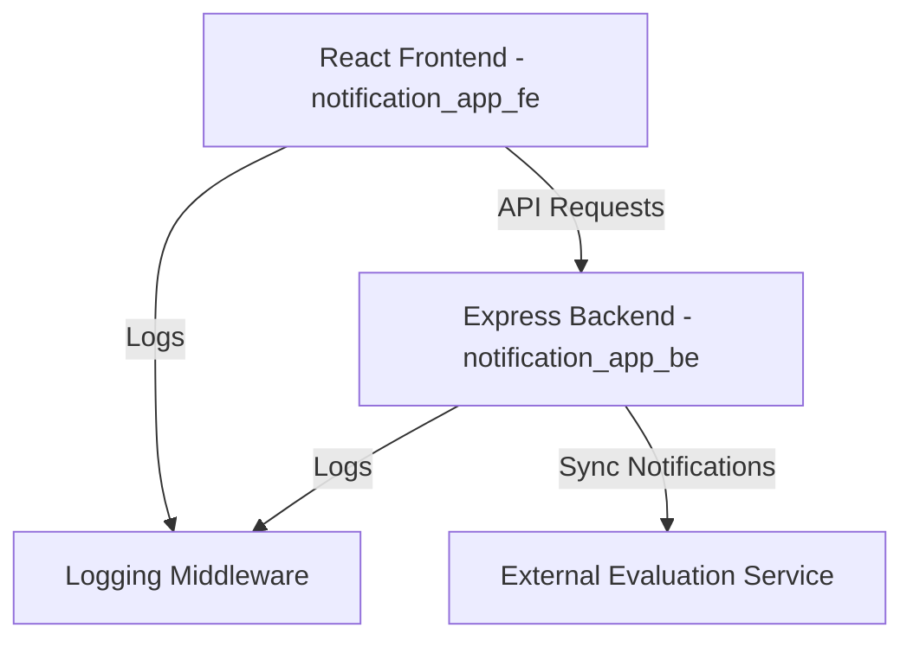

# Campus Notifier Notification System Design

This document outlines the architectural and algorithmic design of the **Campus Notifier Priority Inbox**, an event-driven notification system featuring real-time ingestion, prioritization via a Min-Heap data structure, and full-stack integration.

---

## 1. System Architecture

The Campus Notifier application follows a decoupled three-tier architecture:



1. **Frontend (React)**: High-performance user interface styled with premium dark/light mode themes, supporting standard navigation, filtering, real-time trigger forms, and a Priority Inbox view.
2. **Backend (Node.js/Express)**: Ingests notification streams, manages state (both local notifications and external syncs), and runs the Min-Heap scoring engine to compute priority states dynamically.
3. **External Evaluation Service**: Simulated external data provider representing official campus updates.
4. **Logging Middleware**: Independent monitoring system validating logs and routing them to the evaluation logging endpoint.

---

## 2. Priority Inbox Algorithm (Min-Heap)

To display the top $N$ (default 10) most critical unread notifications efficiently, the backend utilizes a bounded **Min-Heap (Priority Queue)**. 

### 2.1 Scoring Strategy
Notifications are scored based on their `Type` category:
*   **`Placement`**: Score = **3** (Critical)
*   **`Result`**: Score = **2** (High)
*   **`Event`**: Score = **1** (Normal)

### 2.2 Tie-Breaker
When two notifications have identical category scores, their **Timestamp** is used as a tie-breaker:
*   **Newer notifications take precedence** over older notifications.

### 2.3 Insertion & Extraction Logic
A Min-Heap of size $N$ is maintained where the root node always represents the *least* important notification currently in the top $N$ list.

1. **Heap Size < N**: Insert the notification directly into the heap. Heapify-up takes $O(\log N)$ time.
2. **Heap Size = N**: Compare the incoming notification's priority with the root (minimum priority) notification:
    *   If the new notification has a **higher** priority (larger score, or equal score and newer timestamp) than the root, extract the root node and insert the new notification.
    *   Otherwise, discard the incoming notification from the top $N$ priority list.
3. **Retrieval**: Extract all elements from the heap sequentially to output the prioritized list in descending order (highest priority first).

### 2.4 Complexity Analysis
*   **Check/Compare**: $O(1)$ time complexity against the root node.
*   **Insert/Extract**: $O(\log N)$ where $N$ is the size limit (e.g., 10). Because $N$ is a small constant, this simplifies to $O(1)$ operations, making it extremely fast for real-time streams.
*   **Space Complexity**: $O(N)$ auxiliary space for the heap.

---

## 3. API Specifications

### 3.1 Get All Notifications
*   **URL**: `/api/notifications`
*   **Method**: `GET`
*   **Description**: Retrieves the complete list of notifications, merged with synced external records.

### 3.2 Get Priority Inbox
*   **URL**: `/api/notifications/priority`
*   **Method**: `GET`
*   **Query Params**: `limit` (default: 10)
*   **Description**: Computes the top $N$ unread notifications using the Min-Heap engine.

### 3.3 Create Notification
*   **URL**: `/api/notifications`
*   **Method**: `POST`
*   **Body**:
    ```json
    {
      "Type": "Placement" | "Result" | "Event",
      "Message": "string",
      "Timestamp": "YYYY-MM-DD HH:mm:ss"
    }
    ```
*   **Description**: Triggers a new notification locally.

### 3.4 Mark Notification as Read
*   **URL**: `/api/notifications/:id/read`
*   **Method**: `POST`
*   **Description**: Marks a notification as read so that it is excluded from priority processing.
